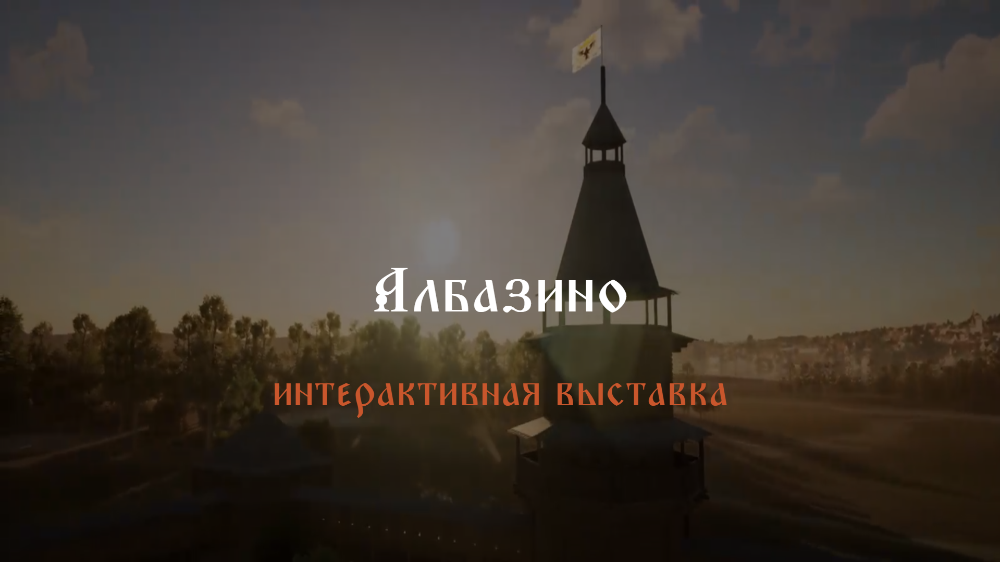
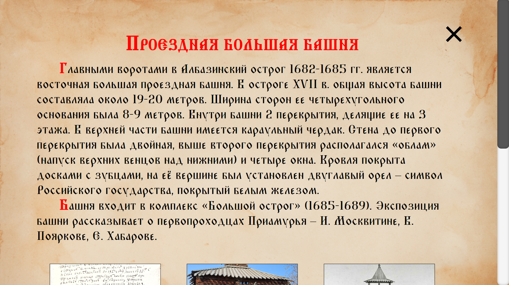
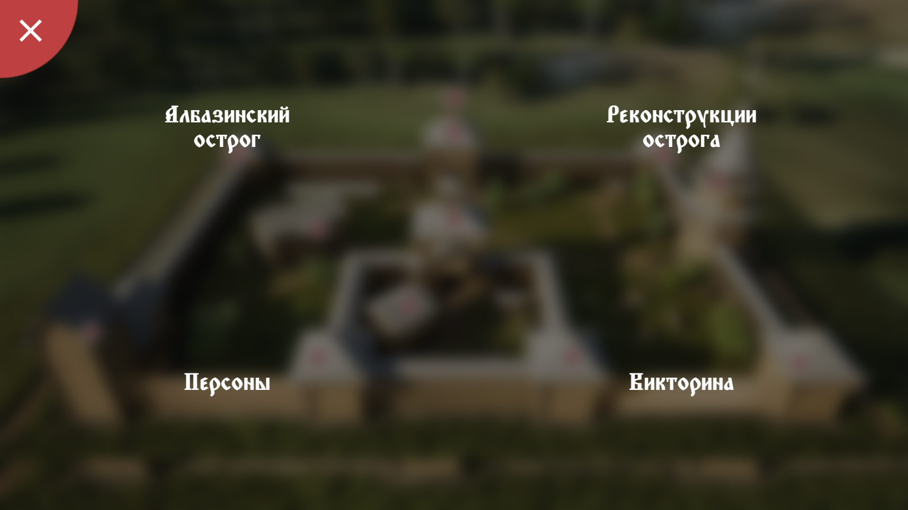

# Информационный стенд про Албазинский острог

## Запуск

1. Склонировать репозиторий
2. Скачать файлы зависимотей ``npm i ``
3. Запустить на локальном сервере
4. Открывшуюся страницу запускать в полноэкранном режиме ``F11``

## Изображения
Ниже представлены несколько изображений информационного стенда

