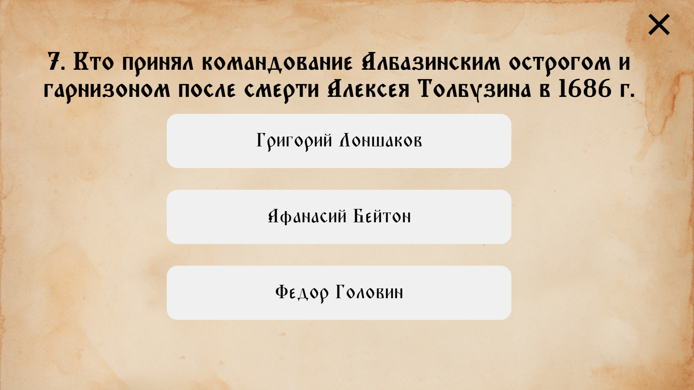

# Информационный стенд про Албазинский острог

## Запуск

1. [Тык на ссылку](https://aemulatio.github.io/albazino/)
2. Открывшуюся страницу запускать в полноэкранном режиме ``F11``

## Изображения

Ниже представлены несколько изображений информационного стенда

